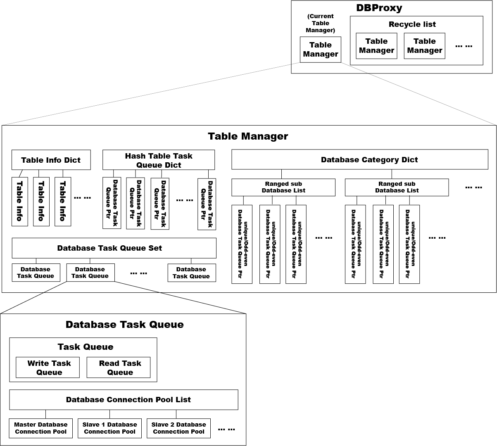

# DBProxy

## 一、简介

+ FPNN 技术生态基础服务
+ MySQL 数据前端代理
+ 屏蔽所有分库分表细节。对高度复杂的分库分表操作，如同对单库单表操作
+ 支持读写/主从分离
+ 支持长链接
+ 支持链接池
+ 支持多 sharding 并发查询和汇总

## 二、运行环境 & 编译

运行环境：

	+ 操作系统：CentOS 6.5、CentOS 7
	+ 支持数据库：MySQL 5.0 以上
	+ 第三方依赖：FPNN 框架、libmysqlclient

编译：

	1. 请先编译 [FPNN 框架](https://github.com/highras/fpnn)
	1. 确保 dbproxy 目录和 fpnn 目录处于同一父目录下
	1. cd dbproxy; make

## 三、功能 & 特性

1. 功能

	+ 屏蔽所有数据库分库分表细节及拓扑结构，统一处理数据定位和数据路由，如同使用单库单表的数据库一样。
	+ 与数据库保持长链接，减少因频繁请求数据库，建立和关闭短链接带来的数据库压力和性能开销。
	+ 在主从库的配置下，对读请求在主从库之间进行负载均衡。
	+ 支持 FPNN 体系所有功能。参见：[FPNN 功能介绍](https://github.com/highras/fpnn/blob/master/doc/zh-cn/fpnn-introduction.md)

1. 特性

	+ 支持 Hash 分库分表
	+ 支持按区段分库
	+ 支持指定区段奇偶分库
	+ 支持指定表在所有区段内再次分表
	+ 支持区段分库时，不同的表可按不同的区段划分
	+ 支持业务分组
	+ 定期自动检查，并自动加载配置库更新信息
	+ 配置库主从部署时，支持配置库的优先排序
	+ 支持单shard内的事务操作
	+ 支持聚合查询

## 四、限制

+ **不支持联合查询，多表查询，JOIN语句等**

	原因：一个SQL要查询的多个表可能不在同一个库，甚至不在同一个数据库实例上。

+ **自动屏蔽／禁止 Create、Drop、Alert 等语句**

	为确保数据安全起见，业务使用者只能使用 select、insert、update、replace、desc/describe/explain、delete 语句。其他语句均须DBA在后台授权操作。

+ **不支持列出数据库内所有数据表名称**

	原因：数据安全原因，需要DBA授权查询

+ **不支持跨库事务操作**
+ **指定表在所有区段再次分表时，分段的类型要和区段分段类型一致**

## 五、使用

对于使用者而言，使用 DBProxy 类似使用一个单库单表的数据库。

+ DBProxy 配置请参考 [DBProxy 配置说明](doc/zh-cn/DBProxy-Configurations.md)
+ DBProxy API 请参考 [DBProxy 接口说明](doc/zh-cn/DBProxy-API.md)
+ DBProxy 运维管理请参考 [DBProxy 运维管理](doc/zh-cn/DBProxy-Operations.md)
+ DBProxy 管理工具请参考 [DBProxy 管理工具](doc/zh-cn/DBProxy-Tools.md)
+ DBProxy 账号与安全请参考 [DBProxy 账号与安全](doc/zh-cn/DBProxy-Account-Security.md)

## 六、DBProxy 技术架构

DBProxy 基于FPNN框架和协议开发。

标准版结构如下图所示

